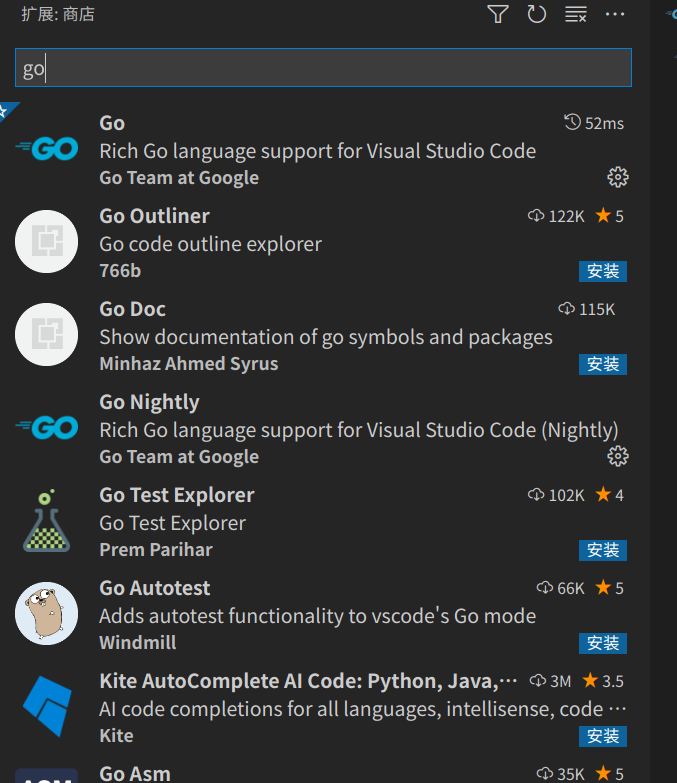
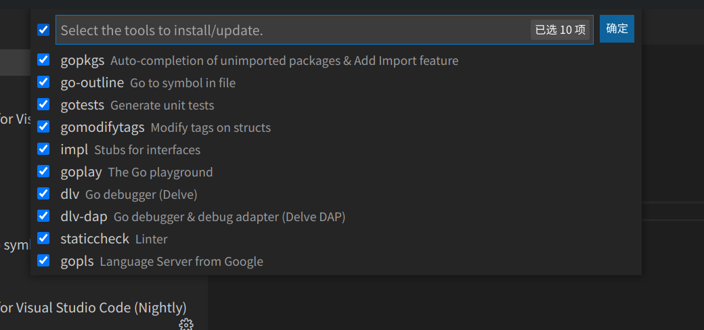
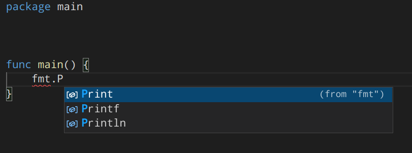

# VSCode配置开发环境

## Golang

### 安装go

- 源码安装

```shell
# clone源码
git clone git@github.com:golang/go.git
# 先安装1.4版本，切换到1.4
git checkout --track origin/release-branch.go1.4
# 执行安装shell
/bin/bash all.bash
# 移到home目录
mv ./go ~/go1.4

# 再clone一份最新release
git clone git@github.com:golang/go.git
git checkout --track origin/release-branch.go1.17
/bin/bash all.bash

# 配置GOROOT和GOPATH 主目录下.bashrc文件添加
export GOROOT="/home/name/sources/go/go1.7"
export GOPATH="/home/name/code/golang"

# 配置代理
export GO111MODULE=on
export GOPROXY=https://goproxy.cn/

# PATH环境变量配置
export PATH="$GOROOT/bin:$GOPATH/bin:$PATH"
source ~/.bashrc
```

### 打开vscode

- 扩展输入go，安装插件即可



- ctrl+shift+p

  - 输入 Go:Install/Update Tools，全选安装，看是否需要翻墙，设置代理应该不用

  

### 安装自动补全

```shell
go get -u github.com/posener/complete/gocomplete
gocomplete -install # 输入y安装
```

