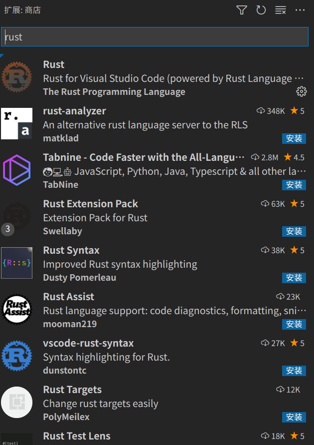
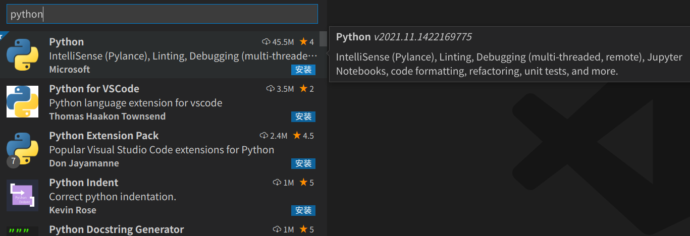
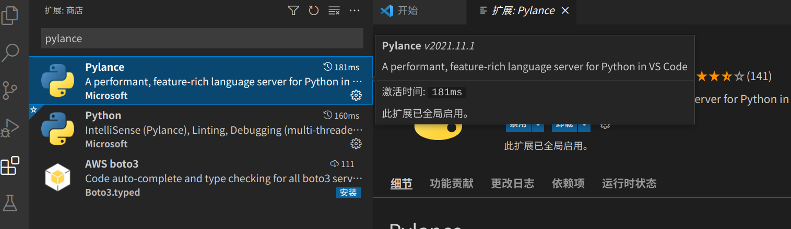
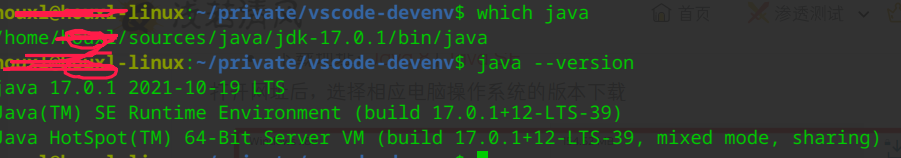

# VSCode配置开发环境

## Golang

### 安装go

- 源码安装

```shell
# clone源码
git clone git@github.com:golang/go.git
# 先安装1.4版本，切换到1.4
git checkout --track origin/release-branch.go1.4
# 执行安装shell
/bin/bash all.bash
# 移到home目录
mv ./go ~/go1.4

# 再clone一份最新release
git clone git@github.com:golang/go.git
git checkout --track origin/release-branch.go1.17
/bin/bash all.bash

# 配置GOROOT和GOPATH 主目录下.bashrc文件添加
export GOROOT="/home/name/sources/go/go1.7"
export GOPATH="/home/name/code/golang"

# 配置代理
export GO111MODULE=on
export GOPROXY=https://goproxy.cn/

# PATH环境变量配置
export PATH="$GOROOT/bin:$GOPATH/bin:$PATH"
source ~/.bashrc
```

### 打开vscode

- 扩展输入go，安装插件即可


- ctrl+shift+p

  - 输入 Go:Install/Update Tools，全选安装，看是否需要翻墙，设置代理应该不用

  

### 安装自动补全

```shell
go get -u github.com/posener/complete/gocomplete
gocomplete -install # 输入y安装
```


- settings.json配置

```json
"go.goroot": "",
"go.gopath": "",
"go.inferGopath": true,
"go.autocompleteUnimportedPackages": true,
"go.gocodePackageLookupMode": "go",
"go.gotoSymbol.includeImports": true,
"go.useCodeSnippetsOnFunctionSuggest": true,
"go.useCodeSnippetsOnFunctionSuggestWithoutType": true,
```


## rust

### 安装rust

[参考](https://www.rust-lang.org/zh-CN/tools/install)

```shell
curl --proto '=https' --tlsv1.2 -sSf https://sh.rustup.rs | sh
```

### vscode 安装插件

[参考](https://marketplace.visualstudio.com/items?itemName=rust-lang.rust)

- ctrl+p，输入ext install rust-lang.rust
- 安装



## Python

### vscode 安装插件

- Ctrl+shift+x，输入python



- 代码补齐pylance



### 格式化代码

```shell
pip install yapf
```

- settings.json中添加

```json
"python.formatting.provider": "yapf"
```

- 快捷键 Alt+Shift+F

### Better Comments插件

### [python 安裝參考](https://github.com/sosop/useage-pyenv-virtualenv)

## Java

### java 安裝



### vscode 安裝插件

- Ctrl+shift+x，輸入Java安裝

